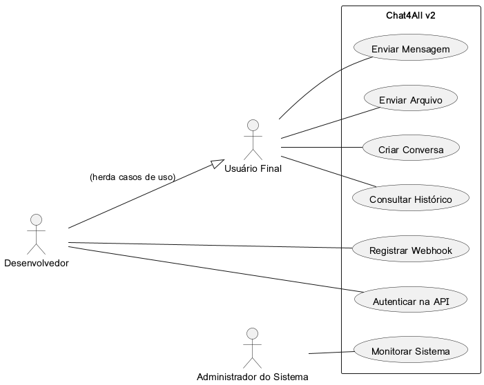
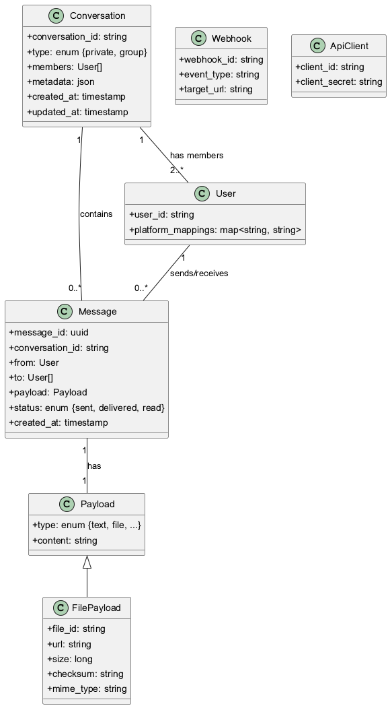
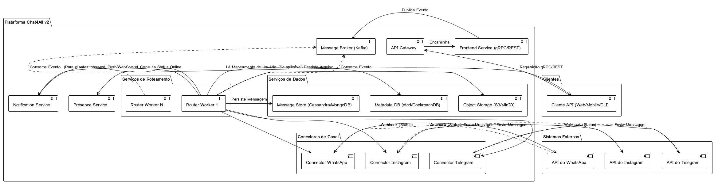
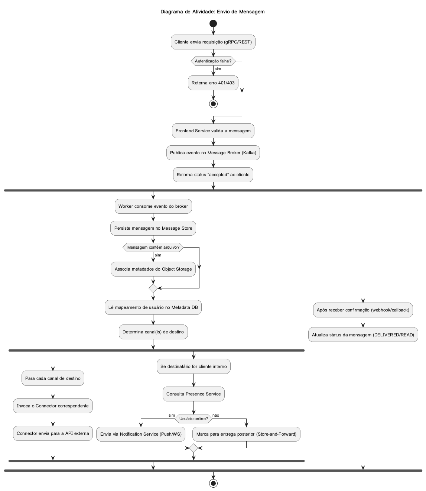
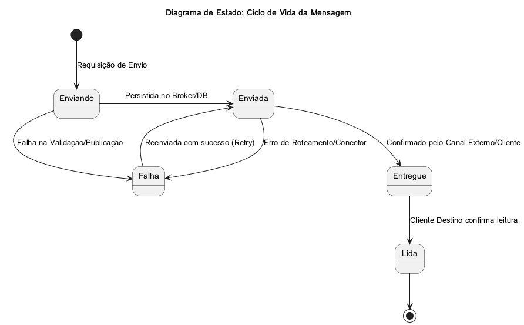
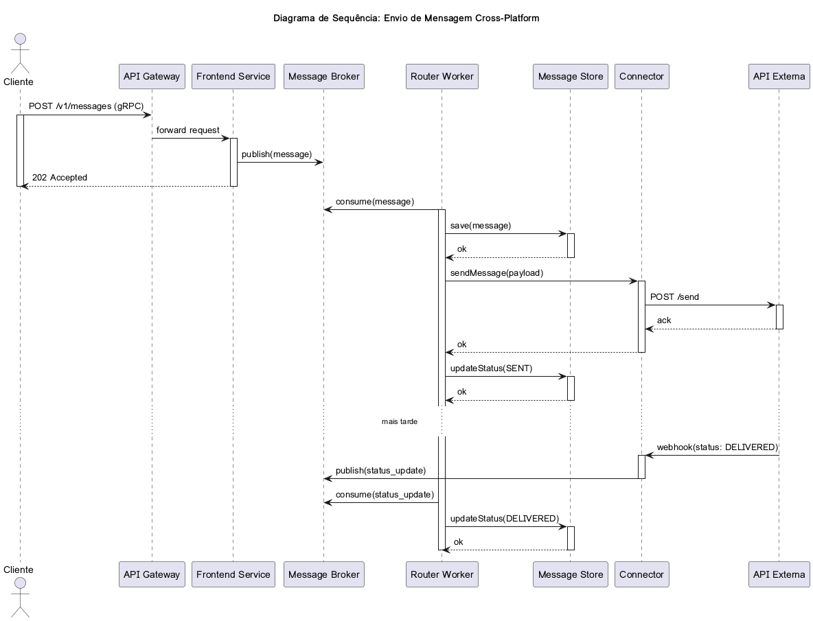
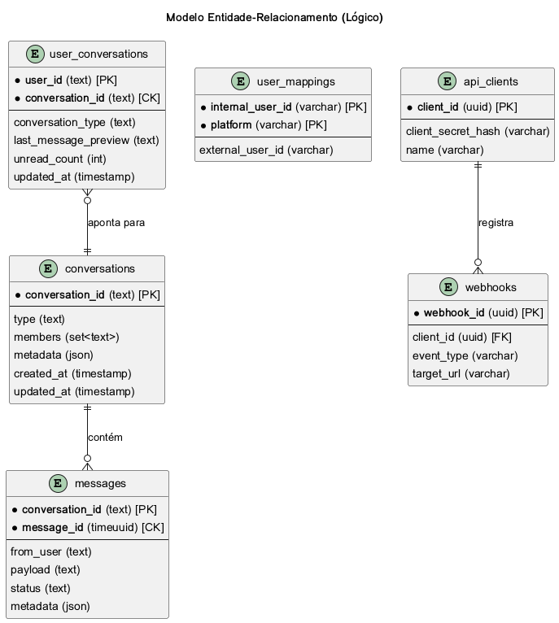

# Documento de Arquitetura de Software: Chat4All v2

**Autores:** Filipe Augusto Lima Silva , Amanda, Guilherme Luís.

**Data:** 17 de Outubro de 2025

**Versão:** 1.0

---

## 1. Introdução

Este documento descreve a arquitetura de software para o projeto **Chat4All v2**, uma plataforma de comunicação ubíqua de alta performance. O objetivo é fornecer uma visão clara e abrangente do design do sistema, suas decisões arquiteturais, componentes e interações. A plataforma foi projetada para ser altamente escalável, tolerante a falhas e extensível, suportando milhões de usuários e um grande volume de mensagens em múltiplos canais de comunicação, como WhatsApp, Instagram Direct, Messenger e Telegram. A comunicação com o sistema será realizada primariamente através de APIs REST e gRPC, garantindo flexibilidade para diferentes tipos de clientes (web, mobile, CLI).

## 2. Convenções, Termos e Abreviações

| Termo/Abreviação | Descrição |
| :--- | :--- |
| **API** | Application Programming Interface |
| **CLI** | Command-Line Interface |
| **gRPC** | Google Remote Procedure Call |
| **REST** | Representational State Transfer |
| **SLA** | Service Level Agreement |
| **UML** | Unified Modeling Language |
| **DER** | Diagrama de Entidade-Relacionamento |
| **MER** | Modelo de Entidade-Relacionamento |
| **POC** | Proof of Concept (Prova de Conceito) |
| **SDK** | Software Development Kit |
| **NFR** | Non-Functional Requirement (Requisito Não-Funcional) |
| **Idempotência** | Propriedade de uma operação que, se executada múltiplas vezes, produz o mesmo resultado que se fosse executada uma única vez. |
| **Chunked Upload** | Processo de enviar um arquivo grande em partes menores (chunks). |
| **Store-and-Forward**| Mecanismo que armazena mensagens temporariamente quando o destinatário está offline e as entrega assim que ele se torna disponível. |
| **Connector/Adapter** | Componente de software que integra a plataforma com um sistema de mensagens externo (e.g., WhatsApp, Telegram). |
| **Message Broker** | Componente de software que gerencia a comunicação assíncrona entre serviços, desacoplando-os. |

## 3. Identificação dos Envolvidos no Projeto

| Papel | Responsabilidades |
| :--- | :--- |
| **Engenheiro(s) de Software** | Responsável pelo design, desenvolvimento, testes e implantação da plataforma Chat4All v2. |
| **Arquiteto(s) de Software** | Responsável pela definição da arquitetura geral, escolha de tecnologias e garantia de que os requisitos não-funcionais sejam atendidos. |
| **Gerente de Projeto** | Responsável pelo planejamento, acompanhamento e entrega do projeto dentro do prazo e orçamento. |
| **Equipe de QA/Testes** | Responsável por garantir a qualidade do software, realizando testes funcionais, de carga e de falhas. |
| **Usuários Finais** | Indivíduos ou empresas que utilizarão a plataforma para se comunicar através dos diversos canais suportados. |

## 4. Problema de Negócio

A comunicação digital moderna é fragmentada em diversas plataformas, forçando usuários e empresas a gerenciar múltiplos aplicativos e identidades. A falta de interoperabilidade entre esses canais cria uma experiência de usuário desconexa e ineficiente. O projeto **Chat4All v2** visa solucionar este problema ao oferecer uma plataforma unificada que atua como um hub central de comunicação. A plataforma permitirá que os usuários enviem e recebam mensagens e arquivos de diferentes canais através de uma única API, abstraindo a complexidade de cada plataforma subjacente e permitindo o roteamento inteligente de mensagens. Isso simplifica a comunicação, melhora a experiência do usuário e abre novas possibilidades para a automação e integração de fluxos de trabalho de comunicação.

## 5. Escopo e Não Escopo

### Escopo

- **Mensageria Multi-Canal:** Roteamento de mensagens de texto e arquivos entre usuários em diferentes plataformas (WhatsApp, Instagram, Telegram, etc.) e clientes internos.
- **API Unificada:** Exposição de APIs REST e gRPC para todas as funcionalidades da plataforma.
- **Persistência de Mensagens:** Armazenamento de histórico de conversas e garantia de entrega para usuários offline.
- **Transferência de Arquivos Grandes:** Suporte para upload e download de arquivos de até 2 GB de forma resumível.
- **Alta Escalabilidade e Disponibilidade:** Arquitetura projetada para suportar milhões de usuários e garantir um SLA de 99.95%.
- **Extensibilidade:** Arquitetura de plugins para fácil adição de novos canais de comunicação.
- **Observabilidade:** Sistema completo de monitoramento, logging e tracing.

### Não Escopo

- **Interface de Usuário Final (UI):** O projeto foca na API de backend. Interfaces de cliente (web/mobile) não fazem parte do escopo principal, embora clientes CLI possam ser desenvolvidos para testes.
- **Gerenciamento de Contas de Usuário em Plataformas Externas:** O sistema não criará ou gerenciará contas de usuário no WhatsApp, Instagram, etc. Ele apenas se integrará a contas existentes.
- **Moderação de Conteúdo:** A plataforma não incluirá funcionalidades de moderação de conteúdo ou filtragem de spam, embora a arquitetura possa permitir a integração futura de tais serviços.
- **Chamadas de Voz e Vídeo:** O escopo está limitado a mensagens de texto e troca de arquivos.

## 6. Entrevistas/Reuniões Realizadas

| Data | Participantes | Tópicos Discutidos | Resumo das Decisões |
| :--- | :--- | :--- | :--- |
| 17/10/2025 | Manus AI, Usuário | Análise do documento de requisitos do projeto. | Alinhamento sobre os 20 tópicos da documentação, confirmação do uso de gRPC e definição do plano de trabalho em fases. |

## 7. Requisitos do Usuário

- Como usuário, quero poder enviar e receber mensagens de texto para contatos em diferentes aplicativos de mensagens (WhatsApp, Instagram, etc.) a partir de um único lugar.
- Como usuário, quero poder criar conversas em grupo com participantes de diferentes plataformas.
- Como usuário, quero poder enviar e receber arquivos grandes (até 2 GB) de forma segura e confiável.
- Como usuário, quero que minhas mensagens sejam entregues mesmo que o destinatário esteja offline no momento do envio.
- Como usuário, quero ter acesso ao meu histórico de conversas, independentemente do dispositivo que estou usando.
- Como desenvolvedor, quero uma API bem documentada (REST e gRPC) para integrar facilmente a funcionalidade de chat em minhas aplicações.

## 8. Tipos de Usuários/Papéis

| Papel | Descrição | Permissões Principais |
| :--- | :--- | :--- |
| **Usuário Final** | O indivíduo que utiliza a plataforma para comunicação. Pode ser um usuário de um cliente web/mobile ou um sistema automatizado. | - Enviar/Receber Mensagens<br>- Criar/Gerenciar Conversas<br>- Enviar/Receber Arquivos<br>- Consultar Histórico |
| **Desenvolvedor** | Utiliza a API pública para integrar a plataforma Chat4All em suas próprias aplicações. | - Autenticar-se na API<br>- Gerenciar Webhooks<br>- Utilizar todos os endpoints da API conforme a documentação |
| **Administrador do Sistema** | Responsável pela manutenção, monitoramento e operação da plataforma Chat4All. | - Acesso aos dashboards de monitoramento<br>- Gerenciar configurações do sistema<br>- Acessar logs e traces para diagnóstico de problemas |

## 9. Requisitos de Sistema

### Requisitos Funcionais

- **RF-001:** O sistema deve permitir a criação de conversas 1:1 e em grupo.
- **RF-002:** O sistema deve permitir o envio de mensagens de texto.
- **RF-003:** O sistema deve suportar o envio de arquivos de até 2 GB.
- **RF-004:** O sistema deve implementar um mecanismo de upload resumível (chunking).
- **RF-005:** O sistema deve persistir mensagens para entrega a usuários offline.
- **RF-006:** O sistema deve fornecer o status de entrega da mensagem (SENT, DELIVERED, READ).
- **RF-007:** O sistema deve rotear mensagens entre diferentes canais (cross-platform).
- **RF-008:** O sistema deve expor uma API pública (REST e gRPC).
- **RF-009:** O sistema deve permitir o registro de webhooks para notificação de eventos.
- **RF-010:** A arquitetura deve ser extensível para suportar novos canais de comunicação.

### Requisitos Não-Funcionais

- **RNF-001 (Escalabilidade):** Suportar milhões de usuários ativos e picos de 10^6 a 10^7 mensagens por minuto.
- **RNF-002 (Disponibilidade):** Manter um SLA de ≥99.95%.
- **RNF-003 (Tolerância a Falhas):** Implementar failover automático de componentes críticos.
- **RNF-004 (Consistência):** Garantir entrega *at-least-once* com deduplicação para simular *effectively-once*.
- **RNF-005 (Ordem):** Garantir ordem causal das mensagens dentro de uma mesma conversa.
- **RNF-006 (Latência):** A latência para caminhos internos (cliente → front → enqueue) deve ser <200ms.
- **RNF-007 (Throughput):** Projetado para milhares de mensagens por segundo, escalando horizontalmente.
- **RNF-008 (Observabilidade):** Implementar monitoramento, tracing distribuído e logging centralizado.
- **RNF-009 (Segurança):** Autenticação de API e terminação TLS no Gateway.

## 10. Regras de Negócio

- **RN-001:** Cada mensagem deve possuir um ID universal único (`message_id`) para garantir idempotência.
- **RN-002:** O particionamento do broker de mensagens (Kafka) deve ser feito pelo `conversation_id` para preservar a ordem causal.
- **RN-003:** Os metadados dos arquivos (URL, checksum, size) devem ser armazenados em um banco de dados, enquanto o conteúdo binário deve ser armazenado em um Object Storage.
- **RN-004:** Cada conector para uma plataforma externa deve rodar como um serviço independente e autoescalável.
- **RN-005:** A interface dos conectores deve ser padronizada (`sendText`, `sendFile`, `onWebhookEvent`).
- **RN-006:** Deve-se implementar uma política de retentativas exponenciais e circuit-breaker nos conectores para lidar com falhas de serviços externos.
- **RN-007:** A API deve ser versionada (e.g., /v1/, /v2/).

## 11. Dependência/Relação entre Requisitos e Regras de Negócio

| Requisito | Regra(s) de Negócio Associada(s) |
| :--- | :--- |
| RNF-004 (Consistência) | RN-001 |
| RNF-005 (Ordem) | RN-002 |
| RF-003, RF-004 (Arquivos) | RN-003 |
| RF-010 (Extensibilidade) | RN-004, RN-005 |
| RNF-003 (Tolerância a Falhas) | RN-006 |
| RNF-009 (Segurança) | RN-007 |

_# Documento de Arquitetura de Software: Chat4All v2 (Continuação)_

## 12. Diagrama de Casos de Uso



## 13. Documentação dos Atores

| Ator | Descrição |
| :--- | :--- |
| **Usuário Final** | Representa o consumidor final do serviço de comunicação. Este ator interage com a plataforma para trocar mensagens e arquivos com outros usuários, que podem estar em diferentes canais. Ele não interage diretamente com a API, mas sim através de uma aplicação cliente (web, mobile, etc.) que consome a API do Chat4All. |
| **Desenvolvedor** | Representa um engenheiro de software que integra a API do Chat4All em suas próprias aplicações. Este ator precisa de acesso à documentação da API, SDKs e um ambiente de sandbox para desenvolver e testar suas integrações. Ele herda todas as capacidades do Usuário Final, mas as executa através de chamadas programáticas à API. |
| **Administrador do Sistema** | Representa a equipe de operações e SRE (Site Reliability Engineering) responsável por manter a plataforma Chat4All. Este ator precisa de ferramentas para monitorar a saúde do sistema, diagnosticar problemas, gerenciar a infraestrutura e garantir que os SLAs sejam cumpridos. |

## 14. Documentação dos Casos de Uso

### UC1: Enviar Mensagem
- **Ator Principal:** Usuário Final
- **Descrição:** Um usuário envia uma mensagem de texto para um ou mais destinatários. A plataforma roteia a mensagem para o(s) canal(is) apropriado(s).
- **Fluxo Principal:**
  1. O usuário (através de uma aplicação cliente) submete uma requisição para enviar uma mensagem, especificando o(s) destinatário(s) e o conteúdo.
  2. A API Gateway autentica e autoriza a requisição.
  3. O Frontend Service valida os dados da mensagem e a publica em um tópico do Message Broker (Kafka).
  4. O Worker/Router Service consome a mensagem do broker.
  5. O Worker persiste a mensagem no Message Store.
  6. O Worker determina o(s) canal(is) de destino com base no mapeamento de usuários no Metadata DB.
  7. O Worker invoca o(s) Connector(s) apropriado(s) para enviar a mensagem à plataforma externa.
  8. O sistema atualiza o status da mensagem para `SENT`.
- **Fluxos Alternativos:**
  - Se o destinatário estiver offline, a mensagem é armazenada (store-and-forward) e o status permanece `SENT`.
  - Se a plataforma externa retornar um erro, o Connector pode tentar reenviar a mensagem (retry).

### UC2: Enviar Arquivo
- **Ator Principal:** Usuário Final
- **Descrição:** Um usuário envia um arquivo para um ou mais destinatários. O sistema gerencia o upload do arquivo e o roteia de forma similar a uma mensagem de texto.
- **Fluxo Principal:**
  1. O cliente inicia o processo de upload de arquivo, recebendo uma URL pré-assinada (presigned URL).
  2. O cliente faz o upload do arquivo em partes (chunks) para o Object Storage.
  3. Ao final do upload, o cliente notifica o sistema, que finaliza o processo e associa o arquivo a um `file_id`.
  4. O usuário envia uma mensagem especial contendo a referência (`file_id`) ao arquivo.
  5. O fluxo segue de forma análoga ao UC1, mas o payload da mensagem contém a referência ao arquivo.
- **Fluxos Alternativos:**
  - Se o upload for interrompido, o cliente pode retomá-lo do último chunk enviado.

### UC3: Criar Conversa
- **Ator Principal:** Usuário Final
- **Descrição:** Um usuário cria uma nova conversa, seja privada (1:1) ou em grupo, adicionando os membros desejados.
- **Fluxo Principal:**
  1. O usuário submete uma requisição para criar uma conversa, especificando o tipo (privada/grupo) e a lista de membros.
  2. A API valida a requisição e cria uma nova entrada de conversa no Message Store, gerando um `conversation_id`.
  3. O sistema retorna o `conversation_id` para o cliente.

### UC4: Consultar Histórico
- **Ator Principal:** Usuário Final
- **Descrição:** Um usuário solicita o histórico de mensagens de uma determinada conversa.
- **Fluxo Principal:**
  1. O usuário requisita as mensagens de uma `conversation_id`, opcionalmente especificando um ponto de partida (timestamp ou cursor).
  2. A API consulta o Message Store para recuperar o lote de mensagens solicitado.
  3. As mensagens são retornadas ao usuário.

### UC5: Registrar Webhook
- **Ator Principal:** Desenvolvedor
- **Descrição:** Um desenvolvedor registra uma URL de webhook para receber notificações de eventos em tempo real, como o status de entrega de uma mensagem (DELIVERED, READ).
- **Fluxo Principal:**
  1. O desenvolvedor submete uma requisição à API para registrar uma URL de webhook para um determinado tipo de evento.
  2. A API valida a URL e a armazena no Metadata DB.
  3. Quando o evento correspondente ocorre (e.g., um Connector recebe uma notificação de entrega), o sistema envia uma requisição POST para a URL do webhook registrado com os detalhes do evento.

### UC6: Monitorar Sistema
- **Ator Principal:** Administrador do Sistema
- **Descrição:** Um administrador utiliza as ferramentas de observabilidade para monitorar a saúde e a performance da plataforma.
- **Fluxo Principal:**
  1. O administrador acessa os dashboards do Grafana para visualizar métricas de throughput, latência, taxas de erro, etc.
  2. O administrador consulta os logs centralizados (ELK/EFK) para investigar problemas específicos.
  3. O administrador utiliza o sistema de tracing (OpenTelemetry) para analisar o fluxo de uma requisição através dos múltiplos serviços.

### UC7: Autenticar na API
- **Ator Principal:** Desenvolvedor
- **Descrição:** Um desenvolvedor obtém um token de acesso para poder fazer chamadas autenticadas à API do Chat4All.
- **Fluxo Principal:**
  1. O desenvolvedor envia suas credenciais (client_id, client_secret) para o endpoint de autenticação.
  2. O sistema valida as credenciais e retorna um token de acesso com tempo de expiração.
  3. O desenvolvedor inclui este token em todas as requisições subsequentes à API.

# Documento de Arquitetura de Software: Chat4All v2 (Continuação)

## 15. Diagrama de Classes de Análise

Este diagrama ilustra as principais entidades de domínio do sistema e seus relacionamentos. Ele serve como um modelo conceitual de alto nível para os dados que a plataforma manipula.



- **Conversation:** Representa uma conversa, que pode ser `privada` ou em `grupo`. Contém uma lista de `membros` (usuários) e uma coleção de mensagens.
- **Message:** A unidade fundamental de comunicação. Contém o remetente (`from`), os destinatários (`to`), o `payload` e o `status` atual.
- **Payload:** O conteúdo real da mensagem. A classe base é estendida para tipos específicos como texto ou arquivo.
- **FilePayload:** Uma especialização do `Payload` para mensagens que contêm arquivos, incluindo metadados como URL, tamanho e checksum.
- **User:** Representa um usuário do sistema, com um ID único e um mapeamento de suas identidades nas diferentes plataformas externas.
- **Webhook:** Entidade que armazena a configuração de um webhook registrado por um desenvolvedor.
- **ApiClient:** Representa um cliente da API, com suas credenciais para autenticação.

## 16. Diagrama de Componentes (Diagrama de Interação)

Este diagrama oferece uma visão da arquitetura de alto nível, mostrando os principais componentes de software e como eles interagem. Ele reflete a natureza distribuída e baseada em microserviços do sistema.



- **API Gateway:** Ponto de entrada único para todas as requisições. Responsável por autenticação, rate limiting e terminação TLS.
- **Frontend Service:** Serviço stateless que expõe os endpoints gRPC/REST. Valida as requisições e as transforma em eventos, publicando-os no Message Broker.
- **Message Broker (Kafka):** O backbone de comunicação assíncrona. Desacopla os serviços de frontend dos workers e garante a durabilidade e a ordem das mensagens.
- **Router Workers:** Serviços que consomem os eventos do broker. Contêm a lógica de negócio principal: persistência, roteamento e invocação dos conectores.
- **Connectors:** Serviços especializados em se comunicar com as APIs das plataformas de mensagens externas (WhatsApp, etc.). Atuam como tradutores entre o modelo de dados interno e o modelo de cada plataforma.
- **Serviços de Dados:**
  - **Message Store:** Banco de dados otimizado para alta taxa de escrita e leitura de mensagens (e.g., Cassandra, ScyllaDB).
  - **Metadata DB:** Armazena dados de configuração, mapeamento de usuários e estado do sistema que exigem consistência (e.g., etcd, CockroachDB).
  - **Object Storage:** Armazena arquivos grandes de forma escalável e econômica (e.g., MinIO, S3).
- **Presence & Notification Services:** Serviços auxiliares para gerenciar o status online dos usuários e enviar notificações push/websockets para clientes internos.

## 17. Diagrama de Atividade

Este diagrama detalha o fluxo de trabalho para o caso de uso principal: o envio de uma mensagem. Ele mostra os passos sequenciais e paralelos envolvidos no processamento de uma única requisição.



O fluxo destaca o desacoplamento entre a recepção da mensagem (síncrona e rápida) e seu processamento subsequente (assíncrono), que ocorre em paralelo para diferentes canais e notificações.

## 18. Diagrama de Estado

Este diagrama modela o ciclo de vida de uma mensagem, mostrando os diferentes estados pelos quais ela pode passar e as transições entre eles.



- **Sending:** Estado transitório inicial, enquanto a mensagem está sendo processada pelo frontend e publicada no broker.
- **Sent:** A mensagem foi persistida com sucesso e enviada ao próximo hop (conector ou cliente interno).
- **Delivered:** O sistema recebeu a confirmação de que a mensagem foi entregue ao dispositivo do destinatário.
- **Read:** O sistema recebeu a confirmação de que o destinatário leu a mensagem.
- **Failed:** Ocorreu um erro irrecuperável no processamento ou entrega da mensagem.

## 19. Diagrama de Sequência

Este diagrama fornece uma visão detalhada da interação entre os componentes ao longo do tempo para o cenário de envio de uma mensagem cross-platform. Ele é crucial para entender a ordem das chamadas de API e eventos, especialmente em um sistema distribuído e assíncrono.



O diagrama ilustra claramente a separação entre a requisição inicial do cliente, que é respondida rapidamente com um `202 Accepted`, e o processamento assíncrono subsequente pelo `Router Worker`, que lida com a persistência e o envio para a plataforma externa. Ele também mostra como as atualizações de status (como `DELIVERED`) chegam de forma assíncrona através de webhooks e são processadas para atualizar o estado da mensagem.

# Documento de Arquitetura de Software: Chat4All v2 (Continuação)

## 20. DER e MER do Banco de Dados

O modelo de dados foi projetado para atender aos requisitos de alta escalabilidade, alta taxa de escrita e leituras eficientes para os padrões de acesso mais comuns em um sistema de mensagens. A persistência é dividida em dois domínios principais: o **Message Store**, otimizado para os dados de mensagens, e o **Metadata Store**, para dados relacionais e de configuração.



### Message Store (Cassandra / ScyllaDB)

Este armazenamento é projetado para lidar com o grande volume de mensagens. A escolha por um banco de dados NoSQL orientado a colunas como o Cassandra ou ScyllaDB se deve à sua capacidade de escala horizontal e performance de escrita.

- **Tabela `messages`**: Armazena todas as mensagens. É particionada por `conversation_id` para garantir que todas as mensagens de uma mesma conversa residam no mesmo nó, permitindo leituras sequenciais eficientes. A chave de clusterização é `message_id` (um TimeUUID), que garante a ordem cronológica e a unicidade das mensagens.
- **Tabela `conversations`**: Armazena informações sobre cada conversa, como o tipo e a lista de membros.
- **Tabela `user_conversations`**: Funciona como um índice para permitir que um usuário encontre rapidamente todas as suas conversas. É particionada por `user_id` e armazena uma referência a cada `conversation_id` da qual o usuário participa, junto com metadados úteis como um preview da última mensagem e a contagem de mensagens não lidas.

### Metadata Store (CockroachDB / PostgreSQL)

Este armazenamento é para dados que requerem consistência transacional mais forte (ACID), como configurações e mapeamentos.

- **Tabela `user_mappings`**: Mapeia o ID de usuário interno do Chat4All para os IDs de usuário correspondentes nas plataformas externas (e.g., ID do WhatsApp, ID do Telegram). É fundamental para o roteamento cross-platform.
- **Tabela `api_clients`**: Armazena as credenciais dos clientes da API que consomem a plataforma.
- **Tabela `webhooks`**: Mantém o registro das URLs de webhook configuradas pelos desenvolvedores para receber eventos.

## 21. Definições da API gRPC

O gRPC foi escolhido como uma das principais interfaces da API por sua alta performance, uso de Protocol Buffers para serialização eficiente e suporte a streaming. Abaixo estão as definições de serviço (`.proto`) para as operações principais, que constituem o esqueleto da API.

```protobuf
// /home/ubuntu/docs/chat.proto
syntax = "proto3";

package chat4all.v1;

import "google/protobuf/timestamp.proto";
import "google/protobuf/struct.proto";

// Serviço principal de Mensageria
service MessagingService {
  // Cria uma nova conversa
  rpc CreateConversation(CreateConversationRequest) returns (Conversation);

  // Envia uma mensagem
  rpc SendMessage(SendMessageRequest) returns (SendMessageResponse);

  // Obtém o histórico de mensagens de uma conversa
  rpc GetMessages(GetMessagesRequest) returns (stream Message);

  // Inicia o processo de upload de um arquivo
  rpc InitiateFileUpload(InitiateFileUploadRequest) returns (InitiateFileUploadResponse);
}

// Serviço de Webhooks
service WebhookService {
  // Registra um novo webhook
  rpc RegisterWebhook(RegisterWebhookRequest) returns (Webhook);
}


// --- Definições de Mensagens ---

message Conversation {
  string conversation_id = 1;
  ConversationType type = 2;
  repeated string members = 3;
  google.protobuf.Struct metadata = 4;
  google.protobuf.Timestamp created_at = 5;
}

message Message {
  string message_id = 1;
  string conversation_id = 2;
  string from_user_id = 3;
  Payload payload = 4;
  MessageStatus status = 5;
  google.protobuf.Timestamp created_at = 6;
}

message Payload {
  oneof content {
    TextPayload text = 1;
    FilePayload file = 2;
  }
}

message TextPayload {
  string text = 1;
}

message FilePayload {
  string file_id = 1;
  string file_name = 2;
  int64 size = 3;
}

enum ConversationType {
  CONVERSATION_TYPE_UNSPECIFIED = 0;
  PRIVATE = 1;
  GROUP = 2;
}

enum MessageStatus {
  MESSAGE_STATUS_UNSPECIFIED = 0;
  SENT = 1;
  DELIVERED = 2;
  READ = 3;
}

// --- Requisições e Respostas ---

message CreateConversationRequest {
  ConversationType type = 1;
  repeated string members = 2;
  google.protobuf.Struct metadata = 3;
}

message SendMessageRequest {
  string message_id = 1; // Opcional, para idempotência
  string conversation_id = 2;
  Payload payload = 3;
  repeated string channels = 4; // Opcional, para forçar canais
}

message SendMessageResponse {
  string message_id = 1;
  MessageStatus status = 2;
}

message GetMessagesRequest {
  string conversation_id = 1;
  google.protobuf.Timestamp since = 2; // Paginação
}

message InitiateFileUploadRequest {
  string file_name = 1;
  int64 file_size = 2;
  string mime_type = 3;
}

message InitiateFileUploadResponse {
  string file_id = 1;
  string upload_url = 2; // URL pré-assinada para upload
}

message RegisterWebhookRequest {
  string event_type = 1; // Ex: "message.delivered", "message.read"
  string target_url = 2;
}

message Webhook {
  string webhook_id = 1;
  string event_type = 2;
  string target_url = 3;
}

```


